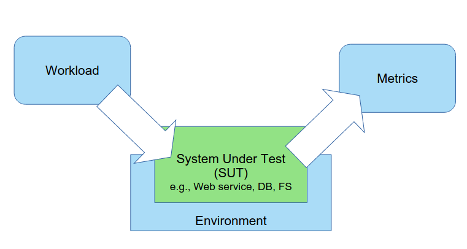
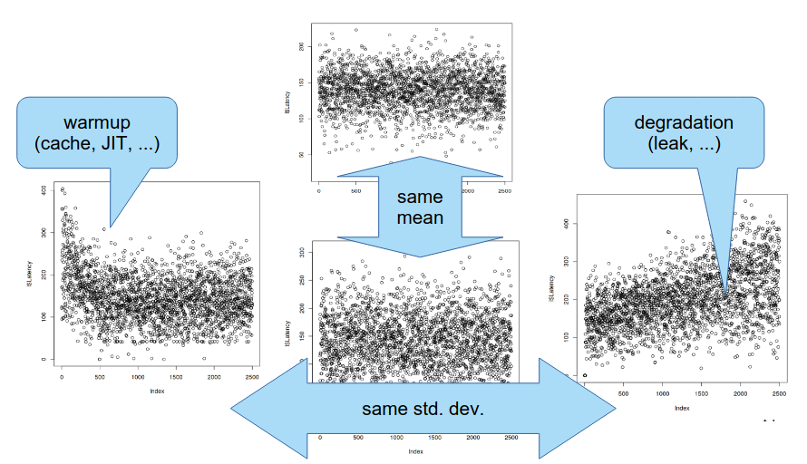
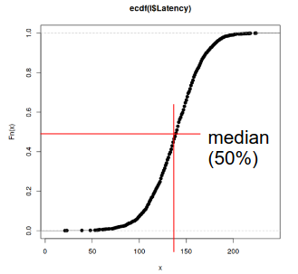
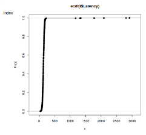
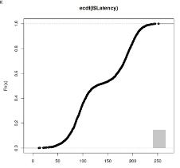

# Teórica 10

## *Benchmarking* (Avaliação)

- O sistema a ser avaliado é denominado SUT (*System Under Test*).
- **Componentes base de uma ferramenta de *benchmarking***
  - *Workload* (Carga);
  - Ambiente;
  - Métricas.

### Carga

- A grande questão reduz-se à quantidade de carga que se deverá induzir ao sistema;
- Além disso, surge ainda a questão de qual será a maneira mais correta de induzir carga ao sistema. Para esta questão, tem-se diversas opções:
  - Colocar a alicação em produção e testar lá;
    - No entanto, geralmente, não queremos testar com a aplicação já em produção.
  - Utilizar dados e pedidos que simulam ações reais dos utilizadores. A isto é chamado *trace*;
    - É difícil ter um *trace* real da aplicação;
    - É difícil de escalar.
  - Gerar pedidos sintéticos.
    - Seleciona um subconjunto de operações;
    - Gera parâmetros aleatórios;
      - Não uniformes (`Zipf`).
    - Agenda pedidos;
      - Concorrentes;
      - Com tempo *inter-arrival* (exponencial).
    - O problema desta abordagem é que é tudo artificial...
- A escolha da maneira que deve induzir carga irá depender daquilo que queremos testar e da aplicação em questão.

### Ambiente

- Devemos perceber o que temos a nível de *hardware* e *software* no ambiente em que estamos a testar.
  - Devemos perguntar o ambiente que está a ser utilizado fará sentido para uma utilização da aplicação em produção.

### Métricas

- Existem múltiplos tipos de métrica, poderá ser o desempenho da velocidade de resposta, se as respostas dadas pelo sistemas estão corretas, etc...

#### Desempenho

- **Tempo de Resposta** (latência): intervalo entre os pedidos do utilizador e a resposta do sistema;
  - À medida que se vai aumentando a carga, é expectável que a latência aumente.
- **Débito**: taxa a que os pedidos são respondidos (p.e. "consegue responder a 30 pedidos por segundo").

**Atenção**: o débito e a latência não são, necessariamente, inversos. Isto só acontece quando o sistema estiver 100% ocupado e for sequencial.

#### Outras métricas

- **Utilização**:
  - Recursos (p.e. CPU, RAM, Rede, Disco).
- **Eficiência**:
  - Rácio entre o débito e a utilização.
- **Resiliência**:
  - Erros.
- **Disponibilidade**:
  - *Uptime vs Downtime*.

### Medições

- Não podemos representar todas as amostras num único número?
  - Por exemplo, na média? Depende do que queremos! A média pode enganar devido a picos;
  - Por exemplo, no desvio padrão? Depende do que queremos! Pode enganar e termos uma perceção errada do sistema...

#### Amostras *vs* Tempo

- Devemos representar cada amostra de forma individual.

#### Amostras *vs* Frequência

- Representar a frequência de cada resultado;
- Utilizar histogramas;
  - Permitir analisar modas, simetrias, etc...
- *Empirical Cumulative Distribution Function* (ECDF);
  - Permite analisar médias, percentis, quartis, etc...

- As ECDFs permitem ainda termos uma comparação direta entre distribuições, bastando juntar as ECDFs de ambas num único gráfico.
##### Padrões das ECDFs:
***Long Tail***: Causado por, por exemplo, paragens no *garbage collector*.

***Bimodal***: causado, por exemplo, por *if statements*.

#### Conclusões da Amostragem

- Permitem ver médias, modas, medianas ou grandes percentis;
- Permitem medir o intervalo de confiança (CI);
- Permitem medir o coeficiente de variação (CV).
  - $$\frac{desvio\ padrao}{media}$$, geralmente, expresso em %.

### Ferramentas

- Existem ferramentas que permitem gerar carga e amostragens;
- Além disso, podemos também utilizar ferramentas para a análise de dados.

### Erros Comuns

- Não ter objetivos ou ter objetivos enviesados;
- Ter uma abordagem não sistemática;
  - Devemos ter *scripts* de tudo, correr sempre tudo no mesmo ambiente, correr múltiplas vezes os mesmos testes, etc...
- Cargas de trabalho não representativas da utilização real da aplicação;
- Fazer uma análise à apresentação de resultados incorreta.

### Conclusões

- Existem múltiplas dimensões para a avaliação de um sistema;
- Para avaliar um sistema, devemos:
  - Avaliar ao longo do tempo;
  - Ter em conta que o sobreaquecimento de componentes pode acontecer;
  - Repetir, múltiplas vezes, os mesmos testes.