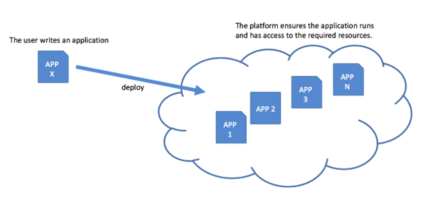
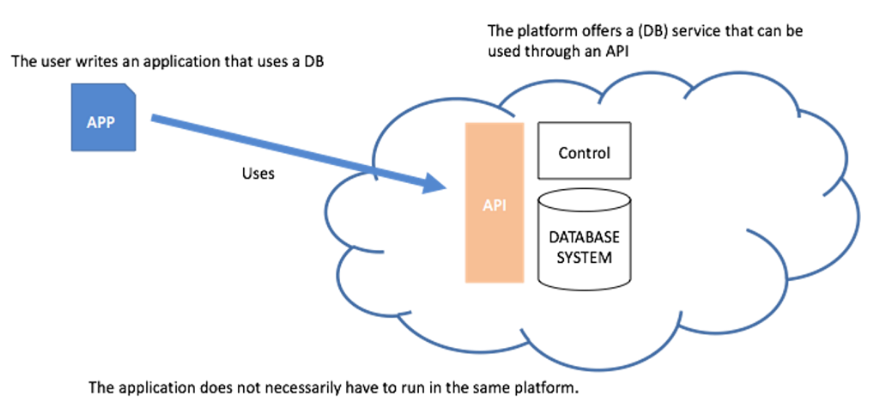

# Teórica 03

## Serviços de *Cloud*

- Os serviços de *cloud* podem ser divididos em 3 abstrações principais:
  - ***Infrastructure-as-a-Service* (IaaS)**;
  - ***Platform-as-a-Service* (PaaS)**;
  - ***Software-as-a-Service* (SaaS)**.

## *Infrastructure-as-a-Service* (IaaS)

- Providencia recursos de *hardware* virtualizados como computação, armazenamento e *networking*;
- Os recursos são alocados *on demand* e só se paga consoante o seu uso;
- Exemplos:
  - Para computação:
    - *Amazon EC2*;
    - *Google Compute Engine*.
  - Para armazenamento:
    - *Amazon S3*.

- Tem *data centers* espalhados pelo mundo, cada um com cerca de 80 000 servidores.

## *Platform-as-a-Service* (PaaS)

- Oferece encapsulamento de um ambiente de desenvolvimento abstrato que pode ser usado para desenvoler, correr, ou dar *deploy* de *apps*.
- Exemplo:
  - *Google App Engine*.

- Baseia-se em instâncias de *containers*;
- Suporta múltiplas linguagens, ferramentas e APIs;
- Providencia controlo de versões, testes, monitorização e *features* de *logging*.

## *Software-as-a-Service* (SaaS)

- Contém aplicações completas ou *software* genérico, tal como bases de dados;
- Oferecido como um serviço e acessível através de um serviço *web* ou através de um *web browser*;
- Exemplos:
  - *SalesForce.com*;
  - *Google Apps (p.e. Gmail)*.

## *OpenStack*

- *Software Open-Source* que permitem a criação de *clouds* públicas e privadas;
- Controla *pools* de computação, armazenamento e *networking* através de um *datacenter*;
- Controlado através de uma *dashboard* ou via a API da *OpenStack*.

### *Cinder*

- Armazenamento em bloco
  - Virtualiza a gestão de dispositivos de blocos de armazenamento;
  - Fornece aos *end users* uma API de auto-serviço para pedir e consumir recursos sem ter conhecimento acerca da verdadeira localização ou do tipo de dispositivo em que se encontra o armazenamento.

### *Swift*

- Grande disponibilidade, distribuídos, armazenamento de objetos/*blobs* eventualmente consistente;
- Ideal para guardar dados não estruturados que podem crescer sem fronteiras.

### *Neutron*

- *Software-Defined-Network* (SDN)
  - Focado em fornecer *Networking-as-a-Service* (NaaS) em ambientes de computação virtuais;
  - Coloca a topologia da rede e o endereçamento de forma abstrata.

### *Telemetry*

- Serviço de Monitorização
  - Coleciona métricas de monitorização para recursos físicos e virtuais;
  - Gera métricas para futura análise;
  - Dá *trigger* de ações quando atinge certas regras (p.e. lançar mais instâncias de uma dada VM quando um *threshold* de CPU é alcançado).

## De IaaS para PaaS

- De alocação gerida e provisionamento de recursos para infraestrutura gerida;
- Recursos atuais tornam-se transparentes;
- Foco na aplicação que é o objeto de *deploy*;
- A interface é o ambiente de programação com APIs para serviços IaaS/SaaS;
- O utilizador pode focar-se na funcionalidade para dar *deploy* ao invés dos recursos necessários para isso.

## De PaaS para SaaS

- Providencia serviços específicos;
- Gere componentes de *software* que exportam as suas APIs tradicionais;
- Sistemas de Gestão de Bases de Dados são exemplos disto;
- Não tem item de *deploy* - a BD está exposta através do cliente e é utilizada como uma BD tradicional com uma configuração mínima e acesso remoto.

## IaaS, PaaS e SaaS: sistemas distribuídos complexos

- Virtualização;
- Provisionamento;
- Monitorização;
- *Reporting*;
- *Billing*;
- ...
- Interoperação entre os pontos acima mencionados.

## Vantagens IaaS, PaaS e SaaS

### Conveniência

- **IaaS**
  - Evita custos *upfront* na gestão da infraestrutura e *hardware*;
  - Permite o *deploy* "fácil" de aplicações *legacy*.
- **PaaS**
  - Foca-se no desenvolvimento da aplicação em si e nos seus requisitos;
  - Desenvolvimento, *deployment*; *debugging* e ferramentas de *benchmarking* *powerful* já no seu local.
- **SaaS**
  - Aproveita componentes existentes (bases de dados, servidores de aplicação e servidores *web*).

### Velocidade

- **IaaS**
  - Infraestrutura já se encontra instalada e configurada.
- **PaaS**
  - *Framework* de desenvolvimento já se encontra instalada e configurada.
- **SaaS**
  - Rápida integração de soluções de *software* em *cloud*.

### Elasticidade

- **IaaS**
  - Ilusão de recursos virtuais infinitos;
  - Aumento e diminuição do poder de computação, espaço de armazenamento e outros recursos *on demand*;
    - Precisa de ser configurado manualmente ou que se recorra a *apps third-party*.
- **PaaS** e **SaaS**
  - Não é necessário gerir a elasticidade manualmente.

## Desvantagens IaaS, PaaS e SaaS

### Perda de Controlo

- **IaaS**
  - Perde-se o controlo sobre o *hardware* específico e o *software* de virtualização;
  - Sem possibilidade de *fine tuning* e otimização da infraestrutura.
- **PaaS**
  - Sem controlo sob o *hardware* específico e da plataforma de PaaS;
  - Gestão, *fine tuning* e monitorização é reduzida às ferramentas providenciadas pela plataforma.
- **SaaS**
  - Aplicações *cloud third-party*.

### Segurança

- **IaaS**, **PaaS** e **SaaS**
  - Tão seguro como o providenciador $\rightarrow$ qualquer vulnerabilidade do providenciador será uma vulnerabilidade da aplicação;
  - Correções às vulnerabilidades devem ser feitas diretamente no providenciador;
  - Se o providenciador falhar (mesmo que seja pouco provável), a aplicação falha e a recuperação está fora do controlo do dono da aplicação;
  - Privacidade dos dados em infraestruturas *third party*.