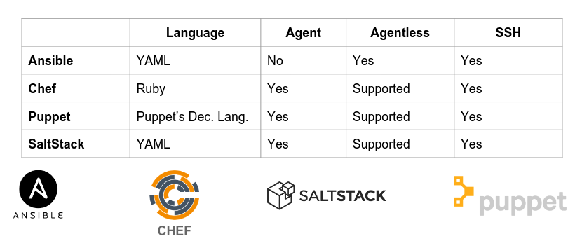
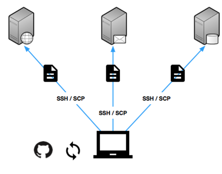

# Teórica 04

## Aprovisionamento de Sistema (*System Provisioning*)

### Aprovisionamento

Ação de providenciar, oferecer algo para uso.

Trata-se da configuração de servidores e recursos. Prepara o sistema para a fase de *deployment*.

Exemplos de ações:

- Aprovisionamento de Servidor;
- Aprovisionamento de Armazenamento;
- Aprovisionamento de Rede;
- Aprovisionamento de VMs;
- Aprovisionamento de Utilizadores.

### *Deployment*

Processo de instalar ou dar *upgrade* de uma aplicação ou serviço num servidor.

- Instalação ou *upgrade* de aplicações *web*:
  - Ficheiros;
  - Migrações;
  - *Assets*.
- Instalação ou *upgrade* de serviços de rede;
- O *scope* é o serviço ou a aplicação.

#### Estas 2 etapas são muito chatas...

- Processo repetitivo;
  - Bom para automação.
- Pode ter sistemas muito diferentes;
  - É preferível manter um inventário dos diferentes sistemas e correr as *tasks* de forma sequencial ou paralela.
- Provavelmente, terá ajustes ao longo do tempo;
  - Ter um controlo de versões pode ser muito positivo.
- Por vezes, pode consumir muito tempo.
  - Deixar a máquina a trabalhar sozinha pode ser muito positivo.

### Gestão de Configurações

Uma forma de controlar trocas sistemáticas no sistema mantendo a sua integridade ao longo do seu ciclo de vida.

- Configuração expressa num dialeto comum;
- Resultado da configuração previsível;
- Configuração evolui com a infraestrutura;
- Documentação da infraestrutura como um efeito positivo;
- Histórico completo de trocas quando é utilizado um sistema de gestão do *source code*;
- Alterações são observáveis;
- Automação do processo;
- Cada unidade de trabalho é expressa como uma receita.

### Receitas/Reutilização/Automação

Define automação de tarefas via um conjunto de diretivas expressas numa dada linguagem (p.e. *bash*).

Existem diversas ferramentas para ajudar neste processo:



Nesta UC iremos utilizar ***Ansible***.

O *workflow* passa a ser da seguinte forma:



**NOTA:**
`scp` é um comando *Unix* que permite copiar ficheiros entre servidores e máquinas locais.

## Ansible

### Vocabulário

- **Inventário**:
  - Grupo dos alvos de *deployment*.
- **Módulo**:
  - Unidade de trabalho reutilizável distribuída com *Ansible* ou desenvolvida para ele.
- ***Task***:
  - Combinação de módulos e argumentos de forma a efetuar uma dada ação.
- ***Handlers***:
  - *Task* especial para responder a uma dada notificação.
- ***Templates***:
  - Permite a criação de configurações dinâmicas.
- ***Role***:
  - Componente configurável e reutilizável que encapsula variáveis, *templates*, *tasks*, *handlers*...
- ***Playbook***:
  - Descreve políticas para sistemas remotos.

### *Overview* do *Ansible*

- Execução de receitas via *SSH* ou localmente sem a necessidade de agentes;
- Receitas são expressas em ficheiros *YAML*;
- Receitas criadas através de módulos e diretivas de *tasks*;
- Receitas organizadas em *roles* e *playbooks*;
- *Hosts* alvo são definidos no inventário;
- Idempotência.
  - Tarefas só correm no caso do alvo diferir daquilo que é expectável que aconteça depois de correr.

### Exemplos de Ficheiros

#### Inventário

Tem extensão `.inv`. Por exemplo, `hosts.inv`:

```
[host]
host-[01:99].example.com

[database]
db-01.example.com
staging.example.com
```
#### *Playbook*

```
- hosts: all
  vars:
    username: someuser
    shell: /bin/bash
  tasks:
  - name: create unprivileged user
    user:
      name: '{{username}}'
      password: 'secretpasswordhash'
      shell: '{{shell}}'
  - name: Set SSH authorized_key
    authorized_key:
      user: '{{username}}'
      state: present
      key: "{{ lookup('file', '/home/' + someuser + '/.ssh/id_rsa.pub') }}

```

Para mais informações acerca do *Ansible* deve consultar-se a sua documentação.