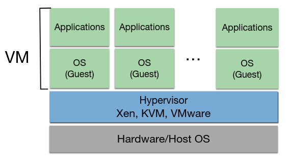

# Teórica 05

## Virtualização

- Técnica que permite criar algo virtual sobre um recurso;
- A ideia é criar uma abstração sobre um recurso qualquer (*software* ou *hardware*);
- Na *cloud*, falamos de virtualização a, praticamente, todos os níveis.

**Exemplos**:

- Redes Virtuais;
- Memória Virtual;
- Volumes de Armazenamento Lógicos.

### Vantagens

#### Heterogeniedade

- Recursos virtuais podem ser providenciados sob diferentes recursos de *hardware*;
- Um recurso virtual poderá correr diferentes aplicações ou serviços utilizando o mesmo *hardware* (p.e. VMs a correrem em diferentes Sistemas Operativos).

#### Transparência

- A interação com uma VM, pela parte do utilizador, é semelhante à interação com uma máquina física.

#### Isolamento

- Os recursos virtuais são isolados uns dos outros em termos de:
  - Segurança;
    - Um cliente não sabe onde é que a máquina virtual se encontra a correr, nem que outras máquinas virtuais se encontram a correr naquele servidor.
  - Desempenho;
    - Depende do componente em questão.
  - Falhas (incluido sistemas operativos ou dados corrompidos).
    - A falha de 1 VM não afeta as restantes.

#### Otimização de Recursos

- Os recursos físicos podem ser otimizados de forma a serem utilizados por diversos clientes.
  - Consolidação do Servidor;
  - Menos Custos.

#### Gestão + Fácil

- A gestão de recursos virtuais é mais simples do que a gestão de recursos físicos.
  - Por exemplo, a migração e *backups* de VMs é muito mais fácil.

### Desvantagens

#### Desempenho

- Geralmente, a virtualização de recursos traz uma *penalty* de desempenho associada.
  - Devido à "tradução" de pedidos lógicos para pedidos físicos.

#### *Overprovisioning*

- Dar *deploy* a mais recursos virtuais do que os disponíveis fisicamente pode gerar degradação de desempenho.

#### Segurança

- O isolamento pode não ser bem feito (p.e. mal endereçado);
  - Existem alguns *bugs* conhecidos nos *hypervisors*;
- Não oferece segurança contra quem acede diretamente ao servidor;
  - Num sistema tradicional, um atacante teria acesso a apenas 1 serviço, no entanto, neste tipo de sistemas, um atacante terá acesso a uma grande quantidade de serviços.

#### Resiliência

- Se um servidor falhar, múltiplos serviços irão falhar.

### Máquinas Virtuais

#### Porque é que surgiram?

- Para permitir correr diferentes Sistemas Operativos em simultâneo no mesmo servidor físico;
- Trocar uma aplicação/serviço para que este corra num Sistema Operativo diferente é uma tarefa difícil e custosa.

#### Arquitetura

- As instruções do *Guest OS* (isto é, da VM) são intercetadas, traduzidas e executadas no *hardware* físico.

##### *Hypervisor*

- Também conhecido por VMM (*Virtual Machine Monitor*);
- Controla a interação *low-level* entre as VMs e o sistema em que estas estão a correr;
- Providencia acesso à CPU, RAM, disco e recursos de *hardware* de rede do *host*.

##### CPU do *Host*

- *Time Slicing* - o processamento de pedidos são divididos e partilhados ao longo das VMs;
  - Se tivermos vários *cores* $\rightarrow$ utilização de 1 *core* por VM e evita-se este processo.
- Semelhante a correr múltiplos processos no *host*;
- Dar *commitment* a demasiados *vCPUs* pode gerar a pior desempenho.

##### RAM e Armazenamento Persistente do Host

- Cada VM tem 1 parte de RAM e 1 parte de disco do *host* associada;
- Não deverá interferir com a parte dos outros (tanto entre VMs, como com o *host*);
  - De forma a manter o isolamento entre recursos;
  - O *hypervisor* está responsável por não deixar o *host* interferir com a parte da VM.
- Armazenamento partilhado entre VMs poderá controlar múltiplos escritores/leitores eficientemente;
- Recursos de Armazenamento podem ser alocados conforme pedido (isto é, *thin-provisioning*).

##### Rede do *Host*

- As VMs partilham a largura de banda e podem ser configuradas com diferentes *setups* de rede:
  - ***Host-only***: Partilha a rede do *host* e só tem acesso ao *host*;
  - ***NAT***: Traduz o IP da VM para o IP do *host* e comunica com a rede exterior utilizando o IP do *host*. A comunicação da rede com a VM pode ser feita através de um protocolo de *forwarding* entre portas de rede;
  - ***Bridge***: Utiliza o *hypervisor* para obter um IP próprio para a VM. A VM é vista, na rede, como um nó de rede físico.

### Modos de Virtualização

#### *Full Virtualization*

- O *Guest OS* é tratado de uma forma completamente abstrata ao *hardware* do *host* em que está a correr (p.e. *VirtualBox*);
- **Vantagem**: Não efetuar modificações para o *Guest OS* funcionar indica que existe uma maior quantidade de Sistemas Operativos suportados e uma maior facilidade de migração e portabilidade de VMs;
- **Desvantagem**: Todas as instruções da VM têm de ser traduzidas no *hypervisor* o que poderá provocar uma queda de desempenho.
  - O *hardware* tem evoluído para combater isto. 
    - A introdução de *Hardware-Assisted Virtualization* (p.e. Intel VT-x, AMD-V) traz *hardware* específico para combater a *penalty* por tradução de instrução.

#### *Paravirtualization*

- Requere gatilhos/modificações ao Sistema Operativo da VM de forma a dar *bypass* às traduções de instruções custosas (p.e. *Xen*);
- **Vantagem**: Melhor *performance*, visto que não existe a tradução de instruções;
- **Desvantangem**: O Sistema Operativo do *Guest* tem de ser modificado, o que é pior para manutenção e portabilidade.

### Tipos de Virtualização

#### Tipo 1 - *Bare Metal Hypervisor*

- O *Hypervisor* não precisa de Sistema Operativo de propósito geral no servidor de *host* (p.e. *VMWare ESX*);
- O *Hypervisor* é *deployed* diretamente no *harware* como se fosse um Sistema Operativo de pequena dimensão;
- Tem uma melhor *performance*, mas precisa de um suporte à virtualização específico no *hardware*, ou seja, é preciso *hardware* específico para correr isto.

#### Tipo 2 - *Hosted Hypervisor*

- O *Hypervisor* é lançado num Sistema Operativo "normal" (p.e. *VirtualBox*);
- Tem um pior desempenho, visto que o Sistema Operativo não é otimizado para virtualização;

**Nota**

- O *KVM* e o *Xen* apresentam uma solução híbrida dos 2 tipos apresentados.
  - Os seus *hypervisors* precisam da instalação de módulos de *kernel* específicos em Sistemas Operativos "normais".