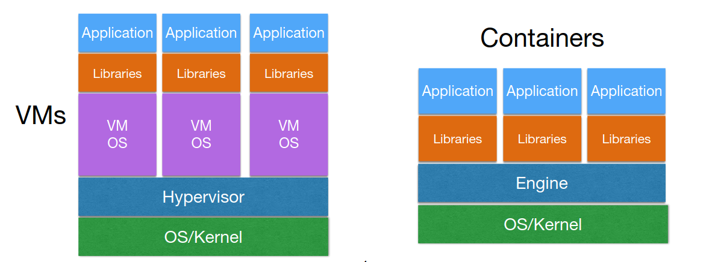
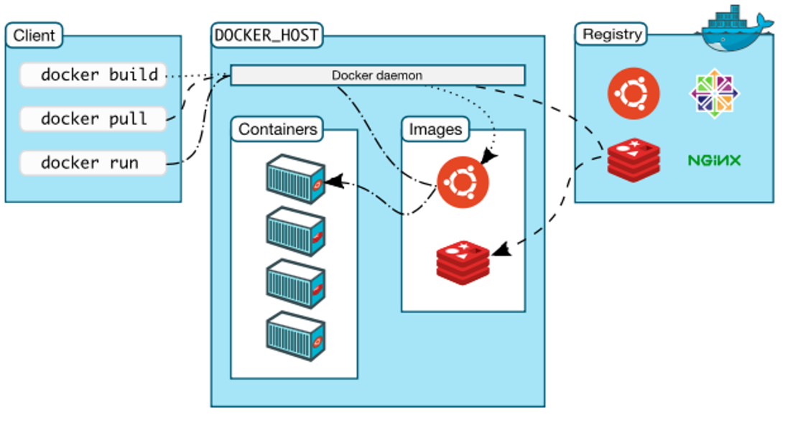
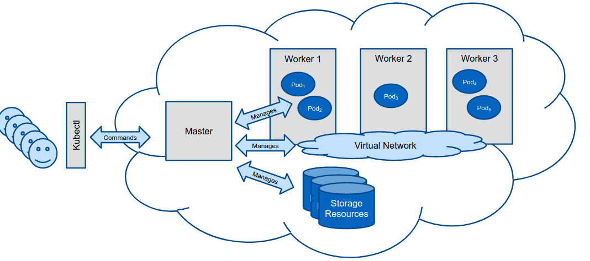

# Teórica 06

## Virtualização

### *Containers*

- Ambiente mais leve que permite ter aplicações a correr e ser bastante portável.
  - O Sistema Operativo não se encontra quebrado do *host*.
    - Ao invés disso, isola conjuntos de processos e recursos.
- **Porque é que são úteis?**
  - Permitem correr diferentes versões da mesma aplicação na mesma máquina;
  - São fáceis de portar e de migrar;
  - A instalação é feita uma única vez.

#### *Linux Containers*
- São **muito leves** e não precisam da virtualização de recuros;
- A *engine* isola e configura os recursos;
- O sistema do *host* é compartimentado para cada *container* em termos de CPU e I/O;
- Existe uma noção de isolamento entre *containers*.

##### *Building Blocks*

- ***Namespaces*** (Isolamento)
  - Ajudam a compartimentar grupos de processos, isto é, a que grupos cada *container* poderá aceder;
  - Permite a partilha de recursos do *host* entre diversos *containers* sem conflitos.
- ***Control Groups*** (Gestão de Recursos)
  - Permite o alocamento de recursos entre grupos de processos;
  - Restringe a quantidade de recursos utilizada por cada *container*;
  - Um grupo de processos terá acesso a um recurso da máquina, no entanto, apenas poderá usar parte dele.
- ***SELinux*** (Segurança)
  - Garante segurança de forma a que um *container* não seja capaz de interferir com outros *containers* ou com o sistema *host*;
  - Garante controlo de acesso e políticas de segurança.

##### Tipos

- ***OS Containers***
  - Simulam um sistema operativo leve;
  - Exemplo: LXC.
- ***Application Containers***
  - Focado em empacator uma *app* e as suas definições;
  - Cada aplicação é vista como um processo independente;
  - Exemplo: Docker.

### Docker

#### Cliente Docker

- Componente utilizada para interagir com a plataforma do Docker;
- Envia pedidos para o Daemon (*engine*) do Docker;
- Gere tudo aquilo que se possa fazer com o cliente;
- Expõe a API do Docker para:
  - Correr e gerir *containers* e redes;
  - Leitura de *logs* e métricas;
  - Extração e gestão de imagens.

#### Daemon do Docker

- Utiliza a API do Docker para receber pedidos do Cliente Docker;
- Gere imagens do Docker, *Containers* e Redes.

#### Objetos do Docker

- ***Image*** - ficheiro imutável que contém o *source code*, as bibliotecas e outros ficheiros necessários para uma dada aplicação correr;
- ***Container*** - instância *runnable* de uma *Image*.

#### Registo do Docker

- Repositório de imagens do Docker.

### Kubernetes

- Automatizam o *deployment*, o escalonamento e a gestão de *containers*;
- **Garantias**:
  - Gestão de redes;
  - Orquestração de armazenamento modular;
  - Agendamento, *self-healing* e escalonamento.

#### *Cluster* de Kubernetes

- Os clientes interagem com o nodo *Master* (p.e. através do `kubectl` no terminal);
- O nodo *Master* gere o *cluster* (p.e. nodos *worker*, *pods*, redes, armazenament, ...).

##### *Pod*, *Deployument* e *Service*

- ***Pod***: unidade computacional composta por um ou mais *containers*;
- ***Deployment***: especifica o ambiente onde vão correr os *pods*;
- ***Service***: expõe um grupo de *pods* como um serviço de rede.

##### Rede

- Cada *pod* tem um único endereço de IP único no *cluster*;
  - As conexões entre *pods* (mesmo em nodo *worker* diferentes) pode ser gerida através de *overlays* de redes.

##### Armazenamento

- Os *pods* podem aceder a volumes de armazenamento providenciados por diferentes *backends* de armazenamento.
  - **Armazenamento Efémero**: os dados sobrevivem apenas durante a sessão;
  - **Armazenamento Persistente**: os dados sobrevivem mesmo após as sessões.

### *Containers vs* Máquinas Virtuais

- A escolha deve depender dos objetivos do utilizador! As diferentes soluções são melhores para diferentes cenários.
  - VMs são úteis quando é necessária uma virtualização *full server* (do Sistema Operativo);
  - *Containers* são úteis para gerir diferentes bibliotecas/aplicações.

#### Vantagens dos *Containers*

- Mais rápidos;
- Melor utilização de recursos;
- Podem ser lançadas em servidores virtualizados ou físicos.

#### Desvantagens dos *Containers*

- Pior isolamento/segurança (Kernel e Sistema Operativo são partilhados);
- Menor flexibilidade a correr em diferentes Sistemas Operativos.