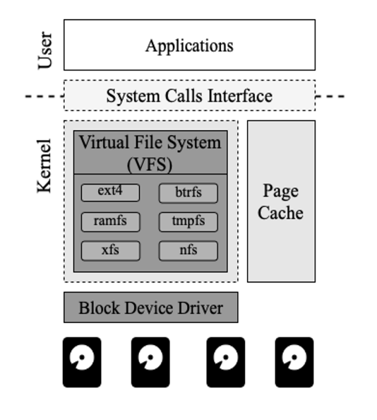
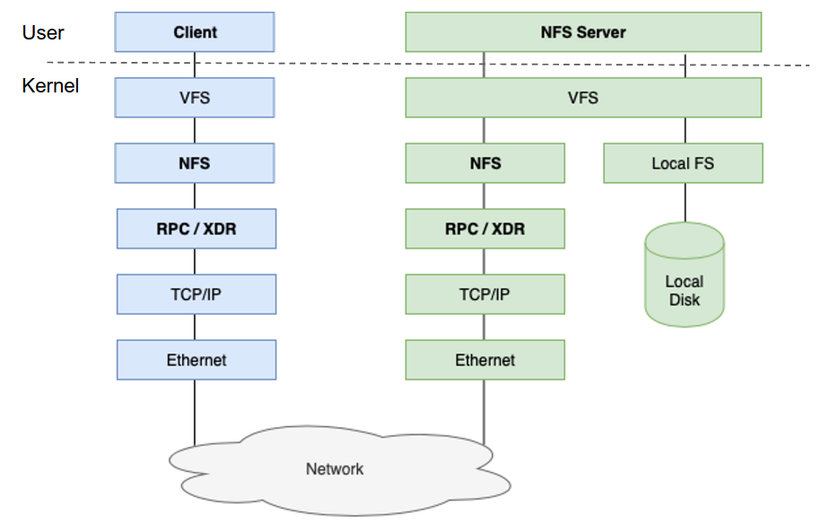
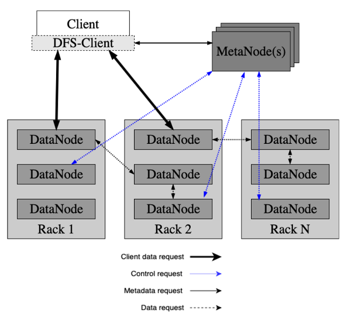
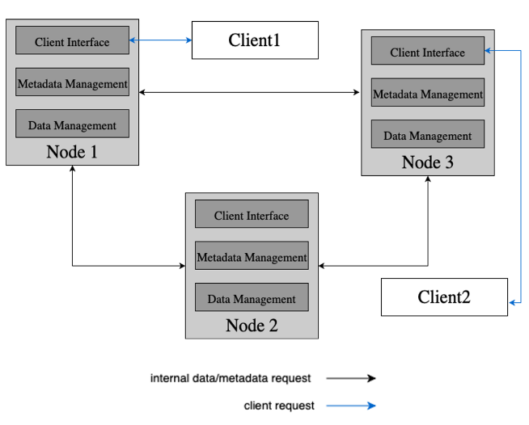

# Teórica 07

## Armazenamento

- **Porque é que estes sistemas são importantes?**
  - Ter dados armazenados, pesistentes e disponíveis;
  - Boa *performance*.

### Tipos

#### Arquivo

- Cópias de coisas que tinha e que pretendo guardar;
- Precisam de ser muito rápido em termos de débito (a latência é praticamente irrelevante);
- Padrão Sequencial;
  - Padrões aleatórios causam lentidão.
- Geralmente, só se irão escrever estes dados uma única vez.
- **Exemplo**: *Amazon Glacier* (serviço na *cloud*).

#### *Backup*

- Precisam de ser muito rápidos em termos de débito;
- Padrão Sequencial;
- Em alguns casos, os dados podem ser atualizados;
- Os dados são atualizados através de *diffs* (muito leves);
  - Em alguns casos, apenas os *diffs* são guardados entre *backups* da mesma fonte.
- **Exemplo**: *Amazon S3* (serviço da *cloud*).

#### Armazenamento Primário

O armazenamento primário pode ser constituído não apenas pela RAM, como também por discos.

- Desejável que tenham grande débito e baixa latência;
  - Grandes quantidades de dados podem ser escritos/lidos;
  - Escritas/Leituras pequenas devem ser eficientes.
- Padrão Sequencial ou Aleatório;
- Os dados e os metadados apresentam uma grande carga de trabalho;
- Dados podem ser atualizados com frequência.
- **Exemplo**: *Amazon EBS* (serviço da *cloud*).

### Meios de Armazenamento

- *Tape*;
  - Armazenamento de Arquivo.
- *HDD*;
  - Aramzenamento de Arquivo, *Backup* ou Primário.
- *SSD* (incluindo *NVMe*);
  - Armazenamento Primário.
- Memória Persistente;
  - Armazenamento Primário.
- RAM.
  - Armazenamento Primário.

### Interfaces de Armazenamento

- ***Block Device***;
  - Interface mais próxima do disco;
  - Os dados são geridos como blocos.
  - Exemplos: *iSCSI*, *Amazon EBS*, *Ceph*, ...
- **Sistema de Ficheiros**:
  - Dados são geridos como uma hierarquia de ficheiros.
  - Exemplos: *Ext4*, *Lustre*, *Ceph*, ...
- **Armazenamento por Objetos**:
  - Dados são geridos como objetos.
  - Exemplos: *Amazon S3*, *Openstack Swift*, *Ceph*.

- Muitas vezes, se uma aplicação está lenta pode ser devido à sua interação com o armazenamento.
- O NFS é muito lento, mas muito utilizado na indústria.
  - Só permite utilizar múltiplos dados num único servidor.

### Scope

#### Local

- *Block Devices* do Sistema Operativo;
- Sistemas de Ficheiros do Sistema Operativo;
- *Kernel vs User Space*.

#### Remoto

- *Block Devices* de Rede;
- Sistemas de Ficheiros de Rede;
- Paradigma Cliente-Servidor.

#### Distribuído (*Data Centers*)

- Grande Escala (ou seja, infraestruturas na *Cloud* e *HPC*);
  - Centenas a Milhares de Nodos;
- *Churn* Estável;
  - Isto é, os nodos que entram e saem do sistema;
  - Mas os nodos podem falhar.
- Não há um ponto único de falha.
  - Dados distribuídos (replicados) entre nodos;
  - Metadados, tipicamente, são geridos por outros nodos.
- Exemplos: *HDFS*, *Ceph*, *Lustre*, *GPFS*.

#### Altamente Distribuído (*Peer-to-Peer*)

- Muito grande escala;
  - Milhares a milhões de nodos.
- Grande *churn*;
  - Nodos falham e são substituídos com frequência.
- Não há um pono único de falha.
  - Dados e metadados distribuídos (replicados) entre nodos;
  - Diferentes nodos podem interagir com a aplicação do utilizador.
- Exemplos: *Napster*, *Gnutella*, *CFS*, *Farsite*, *DataFlasks*.

