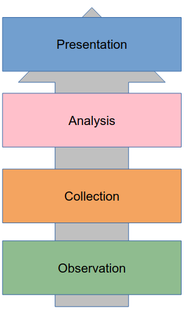
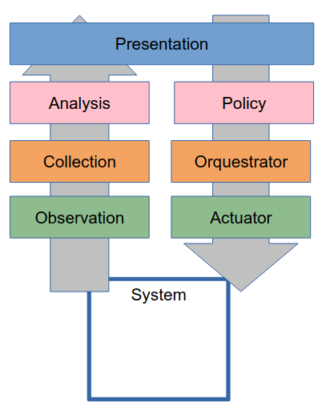

# Teórica 09

## Monitorização

- O monitor é algo que observa a atividade do sistema.
  - O sistema é algo genérico, ou seja, poderá ser 1 CPU, 1 computador, um conjunto de servidores, etc...

### Conceitos

- Um sistema é constituído por:
    - *Hardware*;
    - Lógica (programas).
- Estes têm estado!
  - O estado muda com **eventos**!
    - Um evento é uma unidade de monitorização, ou seja, será o nosso objeto de monitorização que será registado em *traces*.
- Um *trace* é um *log* de eventos.
  - Contém *timestamps*, detalhes de variáveis, etc...

- **Domínio**: exatamente aquilo que queremos observar (métricas que pretendemos estudar);
  - Muitas vezes, o domínio é definido numa abordagem semelhante a tentativa-erro.
- **Detalhe**: qual o detalhe que queremos agregar a informação. De notar que isto terá impacto devido ao *overhead*, ou seja, maior detalhe implicará uma maior carga de trabalho. Varia em:
  - *input rate*: detalhe ao nível temporal (débito ao observar);
  - *resolution*: até que ponto a aplicação é capaz de representar no *input rate* que pretendemos (a representar).

### Classificação do Monitor

- *Event-Driven vs Sampling*: o que é que dará *trigger* para se iniciar a observação?
  - ***Event-Driven***: monitoriza sempre que um evento ocorra;
  - ***Sampling***: monitoriza de vez em quando, em intervalos aleatórios.

- *On-line vs Batch*: quando é que a observação estará disponível?
  - ***On-line***: disponibiliza a observação em tempo real;
  - ***Batch***: disponibiliza a observação de vez em quando, em conjuntos de observações agregados.

- *Hardware vs Software*
  - ***Hardware***: monitor é implementado em *hardware*.
    - Muito rápido;
    - Muito preciso;
    - Nada flexível, ou seja, não conseguimos alterar o que ele irá monitorizar ou outros parâmetros.
  - ***Software***:
    - Lento;
    - Mais flexível, visto que somos nós que implementamos o que pretendemos.
  - Geralmente, utiliza-se o monitor por *software*.

- *Centralized vs Distributed*

### Arquitetura de Monitorização

- Numa aplicação real, o mesmo componente poderá efetuar as funções de diversas camadas lógicas.

- **Camadas Lógicas**:
  - **Observação**: observa os eventos o mais perto possível do local em que ocorrem;
  - **Coleção**: coleciona os dados da observação e normaliza-os;
  - **Análise**: aplica filtros, relaciona e sumariza os dados da coleção;
  - **Apresentação**: cria *dashboards* e outras interfaces de modo a representar os dados ao utilizador.

#### Observação

- Observação passiva ou *spying* (p.e. *network sniffer*);
- Instrumentar:
  - *counters* construídos em sistema;
  - geração de *logs*.
- *Probing* com *requests* adcionais:
  - *ping*

#### Coleção

- *Push Data vs Pull Data*:
  - ***Push Data***: Está constantemente a colecionar dados;
  - ***Pull Data***: De vez em quando pede para colecionar dados.
  - A escolha do tipo de coleção é feita com base na configuração, nas APIs, nos sistemas de *legacy*, etc...
- Resiliência e Persistência de Dados:
  - Por vezes, esta camada é responsável por guardar os dados normalizados para a análise ser feita sobre eles.
- É preciso ter em atenção a sincronização de relógios quando este processo é feito em ambientes distribuídos.

#### Análise

- Tarefa de processamento de dados:
  - *Time Series*;
  - *Searching*.
- É muito importante que esteja bem implementada em ambientes de muito grande escala.
  - Em muitos casos, precisa mesmo de ser distribuída.

#### Apresentação

- Objetivos:
  - Apresentação de métricas de *performance*;
  - Deteção de erros;
  - Dar *tracking* à configuração.

- Resultados:
  - Geração de alertas;
  - Representação gráfica.

### Monitorização e Gestão

- **Políticas**:
  - **Exemplo**: "Se esta VM estiver a utilizar mais que 20% da CPU mata-a".
- **Orquestrador**:
  - Gere as políticas;
  - Através das métricas verifica as política e manda atuar em conformidade.
- **Atuação**:
  - Faz o que o orquestrador lhe ordena.

